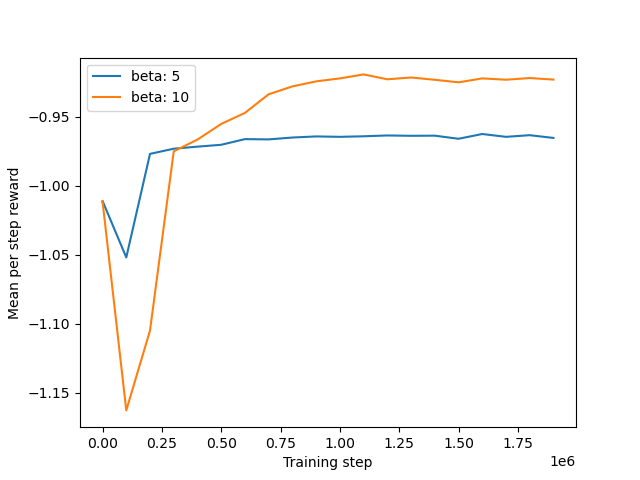

# Supporting code for paper publication

Entropy regularized reinforcement learning using large deviation theory\
A. Arriojas,  J. Adamczyk, S. Tiomkin and R. Kulkarni\
Accepted for publication: April 1, 2023

## Setup

It is recommended to use a python environment manager like Miniconda or PyEnv. Below is an example of how to use the conda command to setup a new environment. The code in this repository requires python 3.8 or greater. It has been tested with python 3.11.

To install miniconda, go to [this link](https://conda.io/projects/conda/en/stable/user-guide/install/index.html) and open instructions for your OS.

To create a new environment with conda, you may run the following command:
```
conda create -n my_env_name python
```
You will be shown the list of packages that will get installed in the new environment, and prompted to confirm the install.
After creating the environment, you need to activate it:
```
conda activate my_env_name
```

Now you are ready to install the required python packages:
```
python -m pip install tqdm joblib numpy pandas scipy matplotlib gym
```

## Reproducing the figures
The script `main.py` can be directly executed to produce most figures in the manuscript, like this:
```
python main.py
``` 

Some figures in the manuscript are time consuming to compute. This script as delivered, will compute simpler versions that will be ready much faster. You can compute the full, time consuming versions of the figures by uncommenting the appropriate lines of code at the bottom of the script `main.py`.

## The result
Here are example images of the figures this code produces:

### Figure 2


### Figure 3


### Figure 5


### Figure 6


### Figure 7


### Figure 8

