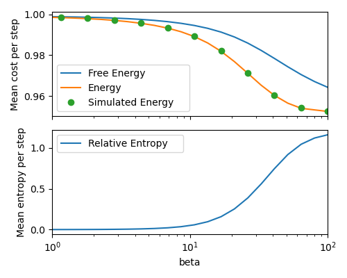
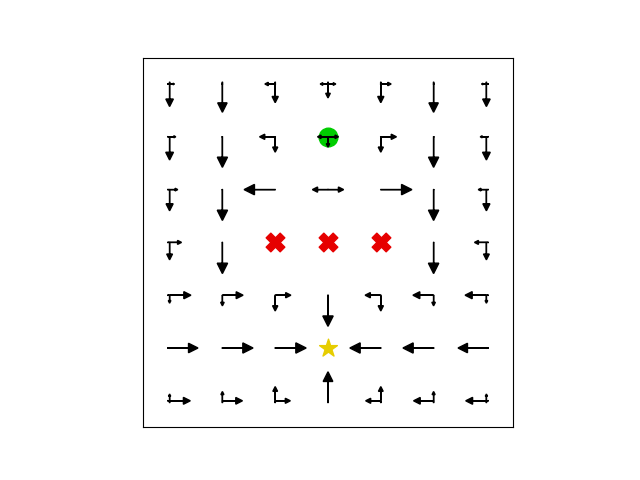

# Example code for article submission

## Setup
```
$ python3 -m pip install -U tqdm joblib numpy pandas scipy matplotlib gym=0.21
```

## Reproducing the figures
The script `main.py` can be directly executed to produce most figures in the manuscript, like this:
```
$ python3 main.py
``` 

Some figures in the manuscript are time consuming to compute. This script as delivered, will compute simpler versions that will be ready much faster. You can compute the full, time consuming versions of the figures by uncommenting the appropriate lines of code at the bottom of the script `main.py`.

## The result
Here are example images of the figures this code produces:

### Figure 2


### Figure 3



### Figure 5


### Figure 6



### Figure 7


### Figure 8

